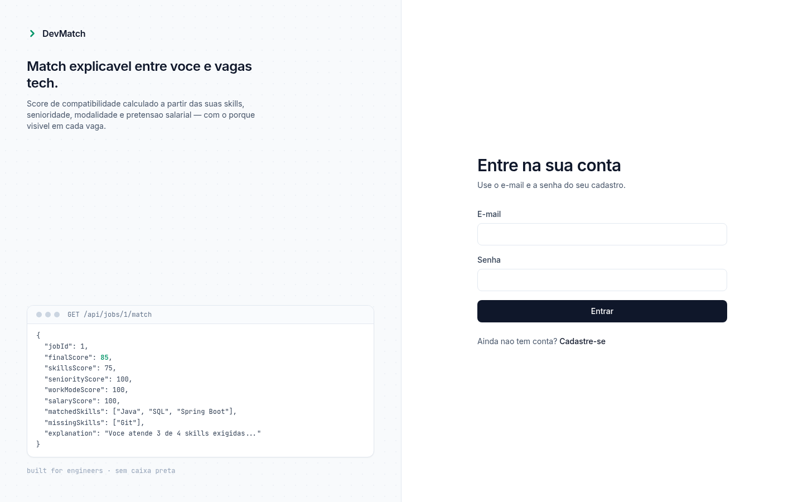
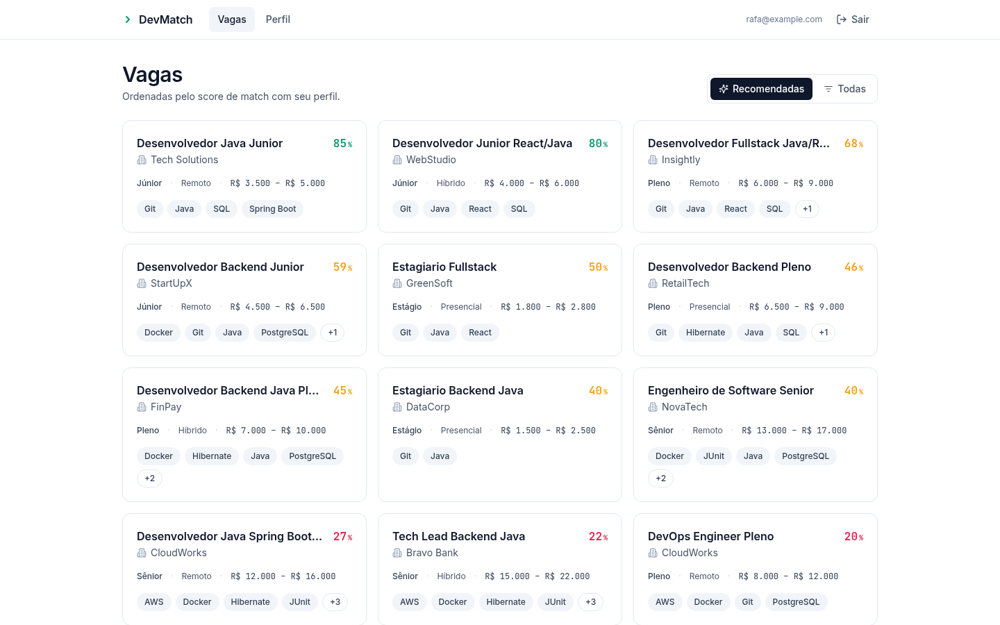
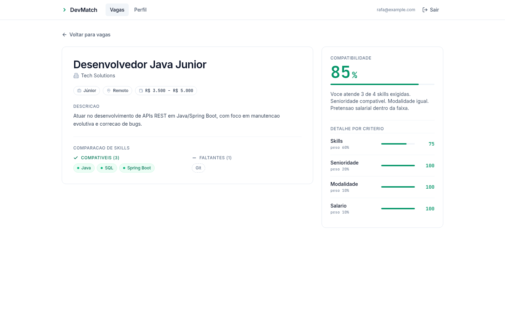
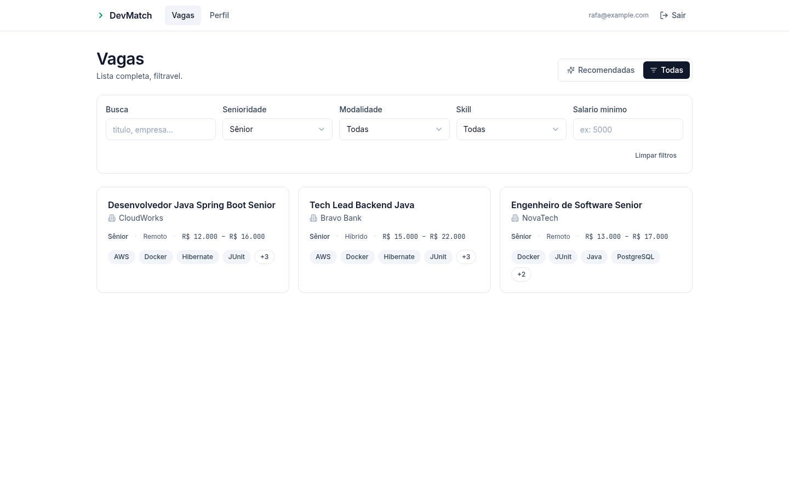
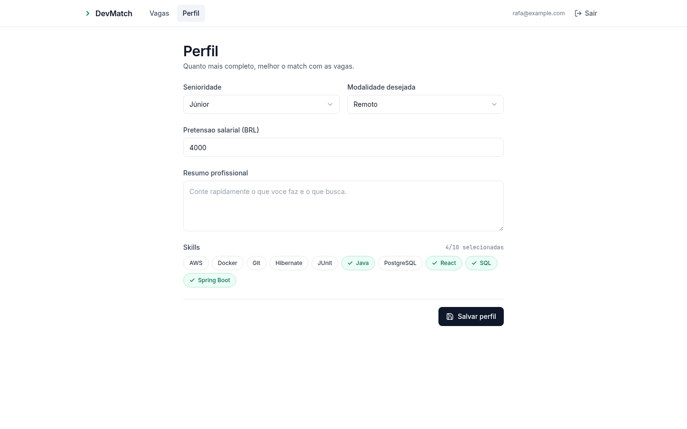
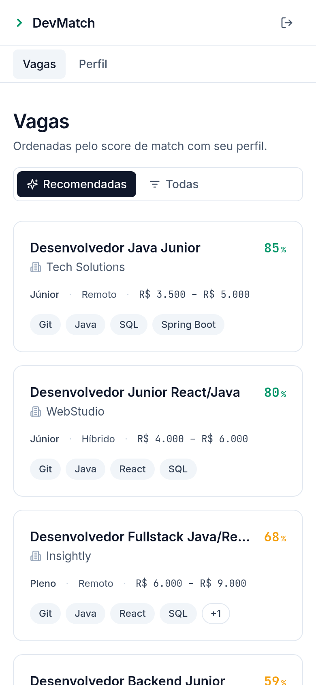
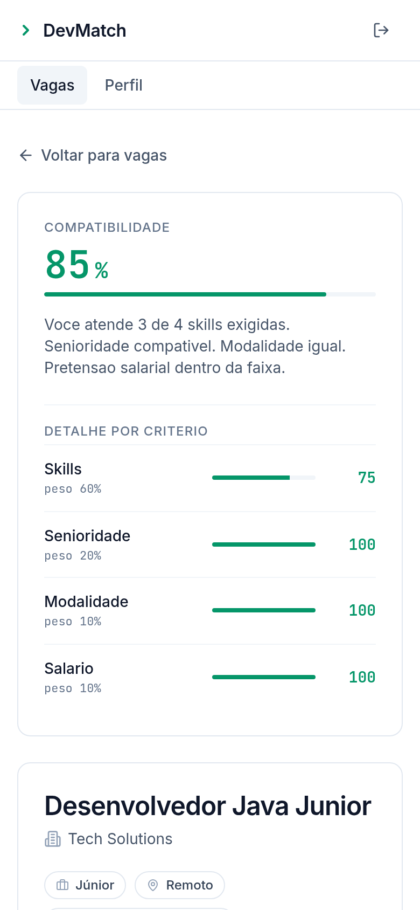
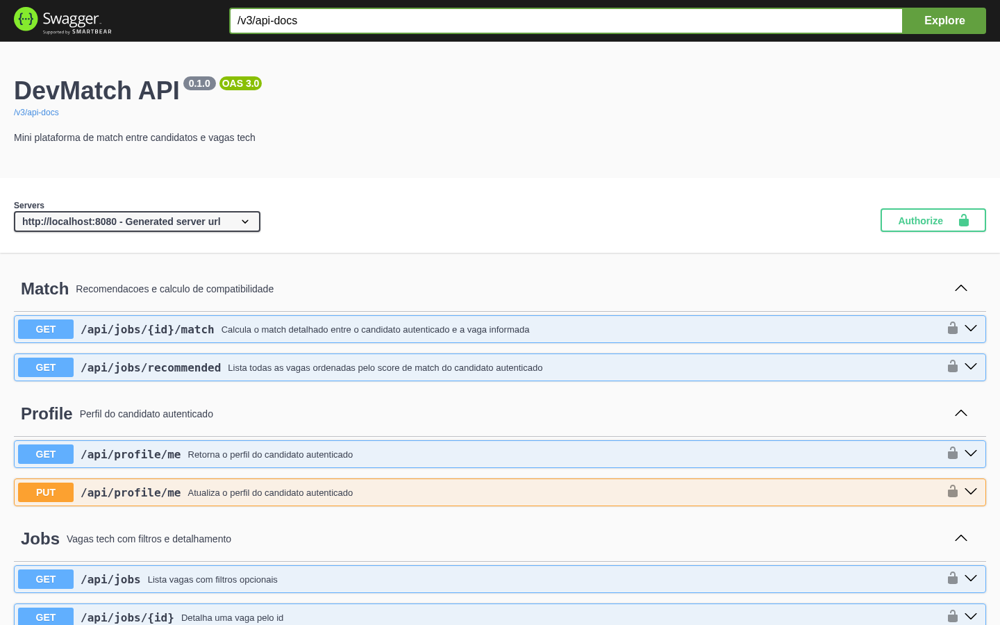

# DevMatch

> Mini plataforma fullstack de match entre candidatos e vagas tech, com algoritmo de compatibilidade **explicavel**.

[](https://github.com/R4ffz/projeto-dev-match/actions/workflows/ci.yml)


---

## Sobre

DevMatch mostra ao candidato **quais vagas tech combinam com ele e por que** — sem caixa preta. Cada vaga vem com um score de 0 a 100 calculado a partir de skills (60%), senioridade (20%), modalidade (10%) e faixa salarial (10%), alem de mostrar as skills compativeis e as faltantes.

Projeto enxuto pensado para portfolio: foco em modelagem, autenticacao JWT, REST limpa, algoritmo testavel e integracao frontend/backend funcionando ponta a ponta.

## Stack

| Camada | Tecnologias |
|--------|-------------|
| **Backend** | Java 21, Spring Boot 3.4, Spring Security, JWT (JJWT 0.12), Spring Data JPA, Hibernate, Maven |
| **Banco** | PostgreSQL 16 |
| **Frontend** | React 18, TypeScript 5.7, Vite 5, React Router 6, Tailwind CSS 3.4, lucide-react, **fetch nativo (sem Axios)** |
| **Testes** | JUnit 5, Mockito |
| **Docs API** | Swagger UI / OpenAPI 3 (springdoc) |
| **Infra** | Docker Compose (3 servicos), Nginx alpine para servir o frontend buildado |

## Funcionalidades

- Cadastro e login de candidato com autenticacao stateless via JWT
- Perfil tecnico: senioridade, salario desejado, modalidade preferida, skills, resumo
- Catalogo de 10 skills pre-cadastradas via seed
- Listagem de 12 vagas tech pre-cadastradas via seed
- Filtros combinaveis: keyword, senioridade, modalidade, skill, salario minimo
- Recomendacao ordenada pelo score de match com o perfil do candidato
- Detalhe da vaga com **match explicavel**: matched/missing skills + breakdown por criterio + frase em PT-BR
- Documentacao interativa Swagger UI com botao Authorize Bearer

## Screenshots

### Login — split layout com preview tecnico do match



### Vagas recomendadas — ordenadas pelo score de match

Score colorido por tier (verde >=70, ambar 40-69, rose <40). Todas as 12 vagas do seed listadas com cards consistentes (titulo, empresa, senioridade, modalidade, faixa salarial, skills com overflow `+N`).



### Detalhe da vaga — match explicavel

Reproduz o exemplo do PDF: candidato JUNIOR/REMOTE/R$4000 + skills [Java, Spring Boot, SQL, React] vs vaga `Desenvolvedor Java Junior` → score final **85**.



### Filtros aplicados (view=all)

`?seniority=SENIOR` reduz para 3 vagas. Filtros refletem na URL e o botao "Limpar filtros" aparece.



### Perfil do candidato

Form simples, skills do catalogo selecionaveis em chips emerald.



### Mobile (390px)

Lista em uma coluna; no detalhe, o card de score sobe para o topo (informacao mais relevante primeiro).

<p>
  
  
</p>

### Swagger UI — documentacao interativa

9 operations agrupadas em Auth / Profile / Skills / Jobs / Match. Botao **Authorize** ao topo para colar o JWT.



> **Como regenerar:** com a stack rodando (`docker compose up`), execute o script Puppeteer (Chrome headless dentro de container) em [`scripts/take-screenshots.cjs`](scripts/take-screenshots.cjs):
> ```bash
> docker run --rm --network=host \
>   -v "${PWD}/scripts:/scripts:ro" \
>   -v "${PWD}/docs/screenshots:/output" \
>   -e NODE_PATH=/home/pptruser/node_modules \
>   -e PUPPETEER_CACHE_DIR=/home/pptruser/.cache/puppeteer \
>   --entrypoint node ghcr.io/puppeteer/puppeteer:latest \
>   /scripts/take-screenshots.cjs
> ```

## Como rodar

**Pre-requisitos:** Docker Desktop com Docker Compose v2. Nada mais — o build do backend e do frontend acontecem dentro de containers Maven 3.9 + JDK 21 e Node 22.

```powershell
# Na raiz do projeto
copy .env.example .env
docker compose up --build
```

Depois do build (~2-5 min na primeira vez), os 3 servicos sobem:

| Servico | URL |
|---------|-----|
| Frontend | http://localhost:5173 |
| API REST | http://localhost:8080 |
| Swagger UI | http://localhost:8080/swagger-ui.html |
| Postgres | localhost:5432 (user/db: `devmatch`) |

**Comandos uteis:**

```powershell
docker compose down            # para os containers
docker compose down -v         # para e apaga o volume do banco
docker compose logs -f backend # acompanha logs do backend
```

## Dev local rapido (frontend com HMR)

Se ja tiver o backend rodando via Docker e quiser hot-reload no frontend:

```powershell
cd frontend
npm install
copy .env.example .env
npm run dev
```

Abre em `http://localhost:5173` com hot module replacement.

## Exemplos da API

Quickstart com curl para validar o fluxo completo (cadastro -> perfil -> match):

### 1. Cadastro

```bash
curl -X POST http://localhost:8080/api/auth/register \
  -H "Content-Type: application/json" \
  -d '{"name":"Rafael","email":"rafa@example.com","password":"senha12345"}'
```

Resposta `201`:
```json
{
  "token": "eyJhbGciOiJIUzM4NCJ9...",
  "tokenType": "Bearer",
  "expiresInHours": 24,
  "user": { "id": 1, "name": "Rafael", "email": "rafa@example.com" }
}
```

### 2. Login

```bash
curl -X POST http://localhost:8080/api/auth/login \
  -H "Content-Type: application/json" \
  -d '{"email":"rafa@example.com","password":"senha12345"}'
```

Resposta `200` no mesmo formato do register.

### 3. Editar o perfil do candidato (autenticado)

```bash
curl -X PUT http://localhost:8080/api/profile/me \
  -H "Authorization: Bearer $TOKEN" \
  -H "Content-Type: application/json" \
  -d '{
    "seniority": "JUNIOR",
    "desiredSalary": 4000,
    "preferredWorkMode": "REMOTE",
    "professionalSummary": "Dev backend Java",
    "skillNames": ["Java", "Spring Boot", "SQL", "React"]
  }'
```

Valores aceitos:
- `seniority`: `INTERN`, `JUNIOR`, `MID_LEVEL`, `SENIOR`
- `preferredWorkMode`: `REMOTE`, `HYBRID`, `ONSITE`
- `skillNames`: itens do catalogo retornado por `GET /api/skills`

### 4. Consultar match com uma vaga

```bash
curl http://localhost:8080/api/jobs/1/match -H "Authorization: Bearer $TOKEN"
```

Resposta:
```json
{
  "jobId": 1,
  "finalScore": 85,
  "skillsScore": 75,
  "seniorityScore": 100,
  "workModeScore": 100,
  "salaryScore": 100,
  "matchedSkills": ["Java", "SQL", "Spring Boot"],
  "missingSkills": ["Git"],
  "explanation": "Voce atende 3 de 4 skills exigidas. Senioridade compativel. Modalidade igual. Pretensao salarial dentro da faixa."
}
```

### 5. Lista de vagas recomendadas

```bash
curl http://localhost:8080/api/jobs/recommended -H "Authorization: Bearer $TOKEN"
```

Retorna todas as 12 vagas ordenadas por `finalScore` descendente.

**Mais exemplos:** [`docs/api.http`](docs/api.http) — arquivo no formato `.http` compativel com VS Code REST Client, IntelliJ HTTP Client e importavel no Postman/Insomnia. Contem 31 requests cobrindo todos os endpoints e cenarios de erro.

## Endpoints

| Metodo | Rota | Auth | Descricao |
|--------|------|------|-----------|
| `POST` | `/api/auth/register` | publico | Cadastra candidato e retorna JWT (24h) |
| `POST` | `/api/auth/login` | publico | Autentica e retorna JWT |
| `GET`  | `/api/profile/me` | JWT | Retorna perfil do candidato logado |
| `PUT`  | `/api/profile/me` | JWT | Atualiza perfil (incluindo lista de skills) |
| `GET`  | `/api/skills` | JWT | Lista skills do catalogo |
| `GET`  | `/api/jobs` | JWT | Lista vagas com filtros opcionais |
| `GET`  | `/api/jobs/{id}` | JWT | Detalha uma vaga pelo id |
| `GET`  | `/api/jobs/recommended` | JWT | Vagas ordenadas pelo score de match |
| `GET`  | `/api/jobs/{id}/match` | JWT | Match detalhado entre candidato e vaga |

Filtros de `GET /api/jobs` (todos opcionais e combinaveis):

| Param | Tipo | Comportamento |
|-------|------|---------------|
| `keyword` | string | LIKE case-insensitive em titulo, empresa e descricao |
| `seniority` | enum | match exato (`INTERN`/`JUNIOR`/`MID_LEVEL`/`SENIOR`) |
| `workMode` | enum | match exato (`REMOTE`/`HYBRID`/`ONSITE`) |
| `minSalary` | decimal | vagas cujo `maxSalary` seja >= este valor |
| `skill` | string | nome exato de uma skill exigida |

## Algoritmo de match

Score de 0 a 100 calculado por:

```
finalScore = skillsScore * 0.60
           + seniorityScore * 0.20
           + workModeScore * 0.10
           + salaryScore * 0.10
```

| Criterio | Peso | Regra |
|----------|------|-------|
| Skills | 60% | `(skills exigidas atendidas / total exigidas) * 100`. Job sem skills retorna 100. |
| Senioridade | 20% | `100` se igual; `50` se 1 nivel proximo; `0` se >= 2 niveis distantes |
| Modalidade | 10% | `100` se igual; `50` se HYBRID em qualquer lado; `0` para REMOTE x ONSITE |
| Salario | 10% | `100` se dentro `[min, max]`; `50` ate 20% fora dos limites; `0` alem disso |

Cada chamada de `/api/jobs/{id}/match` retorna tambem `matchedSkills`, `missingSkills` e uma `explanation` em PT-BR. Logica isolada em [`backend/src/main/java/com/devmatch/match/MatchCalculator.java`](backend/src/main/java/com/devmatch/match/MatchCalculator.java) — sem Spring, sem JPA, coberta por 14 testes JUnit 5.

## Estrutura do projeto

```
devmatch/
├── backend/
│   ├── Dockerfile                   # multi-stage: maven build + temurin jre
│   ├── pom.xml
│   └── src/
│       ├── main/java/com/devmatch/
│       │   ├── auth/                # JwtService, AuthService, AuthController, filtro JWT, DTOs
│       │   ├── common/              # ApiError, GlobalExceptionHandler
│       │   ├── config/              # SecurityConfig, OpenApiConfig
│       │   ├── job/                 # Job, JobService, JobController, JobSpecifications
│       │   ├── match/               # MatchCalculator (pura), MatchService, MatchController
│       │   ├── profile/             # CandidateProfile, ProfileService, ProfileController, enums
│       │   ├── seed/                # DataSeeder idempotente (10 skills + 12 vagas)
│       │   ├── skill/               # Skill, SkillService, SkillController
│       │   └── user/                # User, Role, UserRepository
│       └── test/java/com/devmatch/  # 31 testes JUnit 5 + Mockito
├── frontend/
│   ├── Dockerfile                   # multi-stage: node build + nginx alpine
│   ├── nginx.conf                   # SPA fallback
│   ├── package.json
│   └── src/
│       ├── components/  ui/ layout/ jobs/ profile/
│       ├── contexts/    AuthContext.tsx
│       ├── hooks/       useAuth.ts
│       ├── pages/       Login, Register, Profile, Jobs, JobDetails, NotFound
│       ├── routes/      AppRoutes, ProtectedRoute
│       ├── services/    apiClient.ts (fetch nativo), 4 services
│       ├── types/       DTOs espelhando o backend
│       └── utils/       formatters, matchScore tiers
├── docs/
│   └── api.http                     # 31 requests prontos (VS Code/IntelliJ/Postman)
├── docker-compose.yml
├── .env.example
└── README.md
```

## Testes

**Backend:** 31 testes JUnit 5 (com Mockito nos services).

```powershell
# Roda dentro de um container Maven + JDK 21, sem precisar instalar nada localmente
docker run --rm `
  -v "${PWD}/backend:/workspace" `
  -v devmatch-m2:/root/.m2 `
  -w /workspace `
  maven:3.9-eclipse-temurin-21 mvn test
```

Distribuicao:

| Classe | Cenarios | Foco |
|--------|----------|------|
| `MatchCalculatorTest` | 14 | Algoritmo puro: exemplo do PDF (85), match perfeito, perfil vazio, bordas, arredondamento |
| `MatchServiceTest` | 4 | Combinacao profile+job, ordenacao desc, exceptions |
| `AuthServiceTest` | 5 | Register, email duplicado, normalizacao, login OK, BadCredentials |
| `ProfileServiceTest` | 5 | GET, PUT com skills validas, unknown skill, lista vazia, profile inexistente |
| `JobServiceTest` | 3 | Search com ordenacao, findById, NotFound |

## Checklist de validacao

- [x] Stack sobe inteira com `docker compose up --build` (3 servicos: db, backend, frontend)
- [x] Cadastro e login funcionam (validado por testes unitarios + Swagger + curl + UI)
- [x] JWT protege todas as rotas privadas (401 sem token, em formato JSON)
- [x] Perfil pode ser editado (`PUT /api/profile/me`) e persiste
- [x] Vagas aparecem no frontend (12 vagas em grid responsivo)
- [x] Match calculado e explicado (score 0-100 + matched/missing + breakdown por criterio + frase em PT-BR)
- [x] Swagger UI abre corretamente em `/swagger-ui.html` com Bearer Auth configurado
- [x] README com tecnologias, como rodar, endpoints e algoritmo de match
- [x] Testes unitarios principais com JUnit 5 + Mockito (31 testes verdes)
- [x] Algoritmo de match coberto por testes (`MatchCalculatorTest` com 14 cenarios incluindo o exemplo do PDF)
- [x] Sem secrets reais no repositorio (apenas `.env.example`; `.env` esta no `.gitignore`)
- [x] Frontend nao usa Axios — apenas `fetch` nativo


